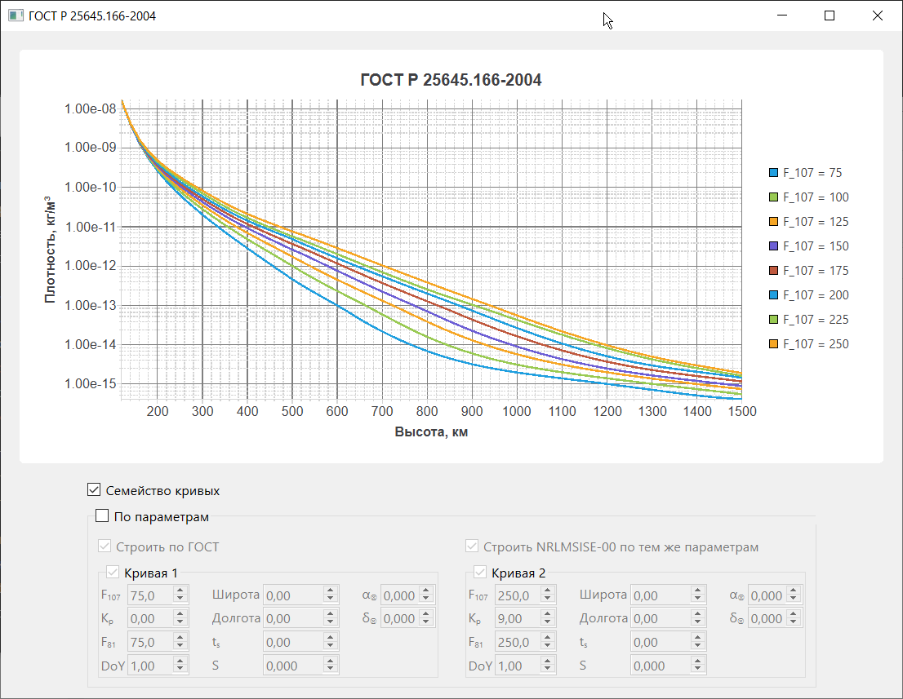
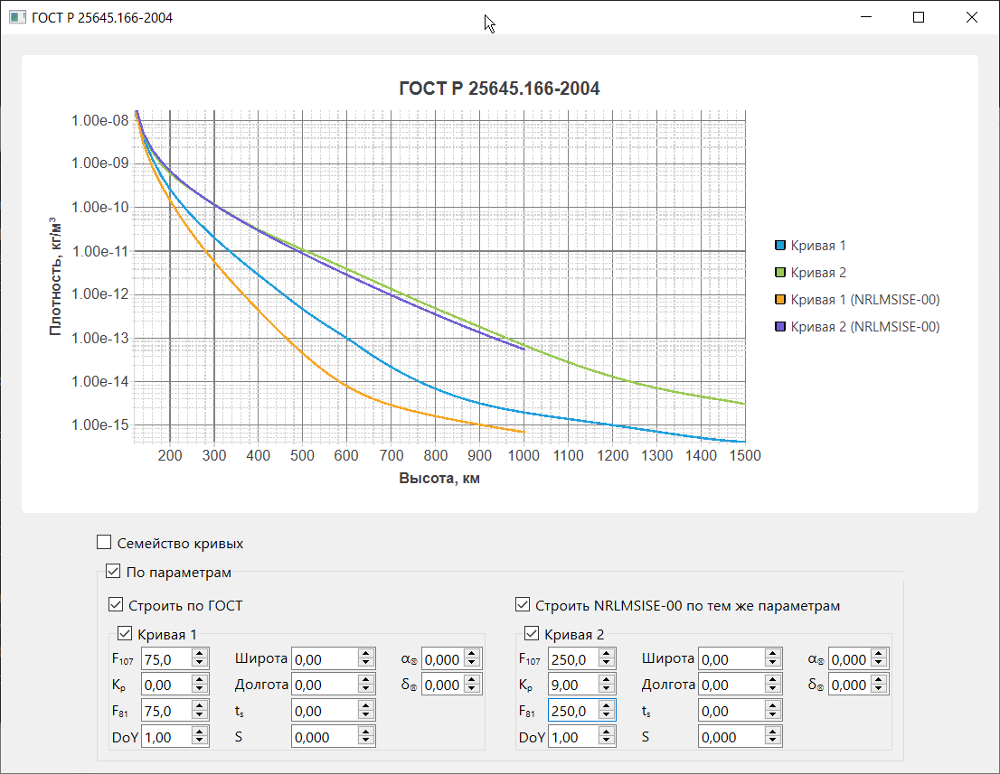

# Upper atmosphere GOST R 25645.166-2004

   

[Документация на русском](README.md)

*(In progress, partially tested yet!)* Function to calculate upper Earth atmosphere density by GOST R 25645.166-2004 model in C++, Python and Matlab. GOST R 25645.166-2004 model is russian equivalent to NRLMSISE-00, Jacchia-Bowman JB-2008 models and others.

## Repo contents

- `atmosGOST_R_25645_166_2004` - C++ sources and model data tables from GOST R 25645.166-2004
- `py_atmosGOST_R_25645_166_2004` - Python-wrapping sources
- `example_app` - C++/Qt example project
- `test` - unit tests

## Use in C++ projects

1. It's a header-only library. Just place `atmosGOST_R_25645_166_2004.h` and `atmosGOST_R_25645_166_2004.cpp` somewhere into your project directory
2. `#include "atmosGOST_R_25645_166_2004.h"`
3. Calculate density by calling `atmosGOST_R_25645_166_2004()` function with appropriate parameters (look comments to function in atmosGOST_R_25645_166_2004.cpp or into GOST R 25645.166-2004 document itself).

## Example application

`example_app` directory contains example C++/Qt/CMake project, shows the use of library and builds density vs altitude:

1) for family of curves with increasing F81=F107;
2) for two user-defined curves.

<table style="border:none;padding:0px;margin:0px;">
    <tr style="border:none;padding:0px;margin:0px;">
        <td style="border:none;padding:2px;margin:0px;">
            
        </td>
        <td style="border:none;padding:2px;margin:0px;">
            
        </td>
    </tr>
</table>

## TODO

- [ ] Python and Matlab functions.
- [ ] Performance optimization.
- [ ] Documentation.
- [x] Internationalization.
- [x] CMake infrastructure.
- [ ] Tests.
- [ ] CI/CD.
