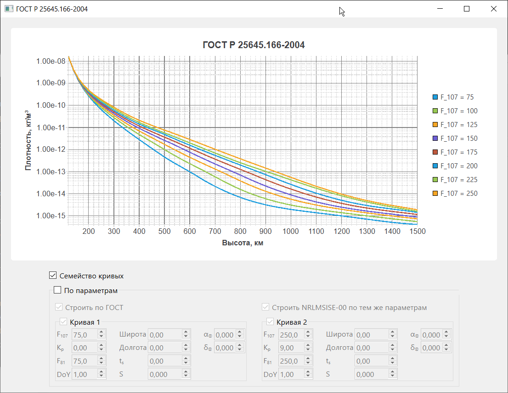
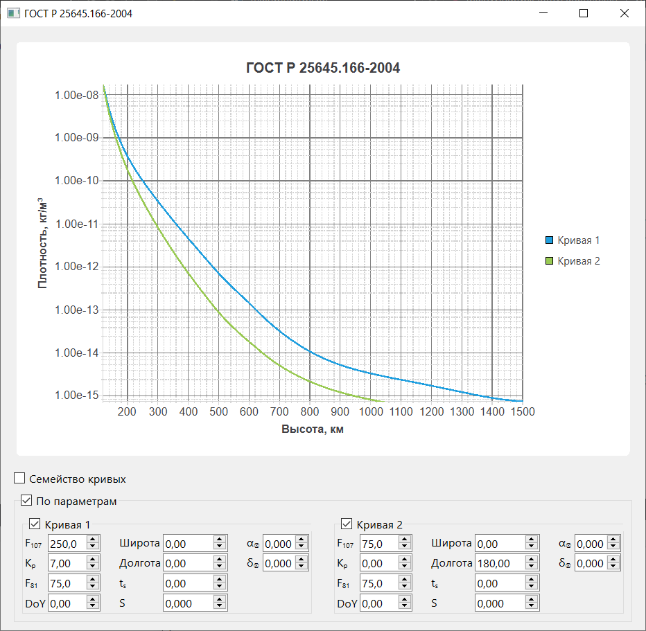

# Атмосфера Земли верхняя ГОСТ Р 25645.166-2004

   

[English version](README.EN.md)

*(В доработке, протестировано частично!)* Функция для расчёта плотности верхней атмосферы Земли по модели ГОСТ Р 25645.166-2004 для C++, Python и Matlab. Модель ГОСТ Р 25645.166-2004 - российский аналог моделей верхней атмосферы NRLMSISE-00, Яккиа-Боумана JB-2008 и других.

## Структура репозитория

- `atmosGOST_R_25645_166_2004` - исходный код функции на C++ и табличные данные для модели из ГОСТ Р 25645.166-2004
- `py_atmosGOST_R_25645_166_2004` - исходный код Python-обёртки
- `example_app` - проект на C++/Qt, демонстрирующий подключение библиотеки
- `test` - модульные тесты

## Использование библиотеки

1. Поместите `atmosGOST_R_25645_166_2004.h` и `atmosGOST_R_25645_166_2004.cpp` в каталог вашего проекта.
2. `#include "atmosGOST_R_25645_166_2004.h"`
3. Плотность рассчитывается вызовом функции `atmosGOST_R_25645_166_2004()` с соответствующими параметрами (см. в комментарии к параметрам функции либо в сам ГОСТ Р 25645.166-2004).

## Пример приложения

Располагается в каталоге `example_app`, реализован на C++/Qt/CMake и демонстрирует подключение библиотеки, а также позволяет строить зависимость плотности атмосферы по высоте:

1) для семейства кривых с различными значениями F81/F107;
2) для двух кривых с параметрами, полностью задаваемыми пользователем.

<table style="border:none;padding:0px;margin:0px;">
    <tr style="border:none;padding:0px;margin:0px;">
        <td style="border:none;padding:2px;margin:0px;">
            
        </td>
        <td style="border:none;padding:2px;margin:0px;">
            
        </td>
    </tr>
</table>

## TODO

- [ ] Обёртка для Python and Matlab.
- [ ] Оптимизация.
- [ ] Документация.
- [x] Многоязычная версия репозитория.
- [x] Адаптация под CMake.
- [ ] Модульное тестирование.
- [ ] CI/CD.
- [ ] расчёт звёздного времени в гринвичскую полночь \$`S^*`\$, склонения \$`\alpha_\oplus`\$ и приямого восхождения \$`\delta_\oplus`\$
